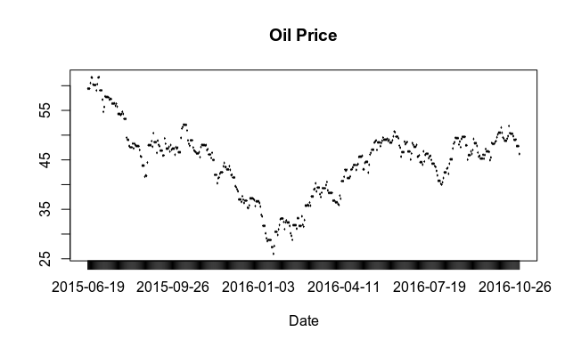

[Home](https://mgcodesandstats.github.io/) |
[Time Series Consulting](https://mgcodesandstats.github.io/timeseriesconsulting/) |
[Portfolio](https://mgcodesandstats.github.io/portfolio/) |
[Terms and Conditions](https://mgcodesandstats.github.io/terms/) |
[E-mail me](mailto:michael@michaeljgrogan.com)

# Do you have time series data that you need to leverage to its full potential?

Feel free to e-mail me for an initial discussion on exactly how I can help you. With over five years of experience in using Python and R, I have used time series analysis to implement business intelligence solutions across a variety of industries. I am also involved in a range of research initiatives pertaining to time series analysis, and have presented my work at international conferences.

Some examples of time series projects I have worked on include:

- Panel data modelling for a major financial institution
- Sales forecasting and analysis across a variety of industries
- Road traffic modelling for a local governmental authority

# Portfolio Examples

## [Kalman Filter: Modelling Time Series Shocks with KFAS in R](https://mgcodesandstats.github.io/kalman-filter-shocks-kfas/)

Time series shocks in the currency market were modelled in this instance using a model known as the Kalman Filter. The model showed high responsiveness in adjusting for the sudden downtrend in GBP/USD one day before “Brexit”, and for the USD/CHF one day before the depegging of the euro against the Swiss franc.

## [Modelling time series relationships between the S&P 500 and oil prices](https://mgcodesandstats.github.io/time-series-relationships-economics/)

In this example, an OLS regression model is constructed to forecast future S&P 500 levels based on the price of Brent crude oil. The model was adjusted for serial correlation, and tested for cointegration. The model was able to predict the actual values of the S&P 500 within 5% accuracy on average, with 61% of prediction errors falling below 5%.

## [Predicting commercial electricity consumption with an LSTM neural network](https://mgcodesandstats.github.io/electricity-consumption-neural/)

Here is an illustration of how the LSTM neural network was used to forecast energy consumption of the Dublin City Council Civic Offices using data between April 2011 – February 2013. The LSTM model demonstrated a low test error (root mean squared error) in forecasting electricity trends.

## [SARIMA: Forecasting seasonal data with Python and R](https://mgcodesandstats.github.io/arima-model-statsmodels-python/)

SARIMA was used to model seasonal weather data for Dublin, Ireland from 1941 to 2019. The ARIMA model was adjusted for seasonality, and demonstrated a mean percentage error of -0.3%. Moreover, the number of predictions with a percentage error below 10% relative to the actual was over 70%.
